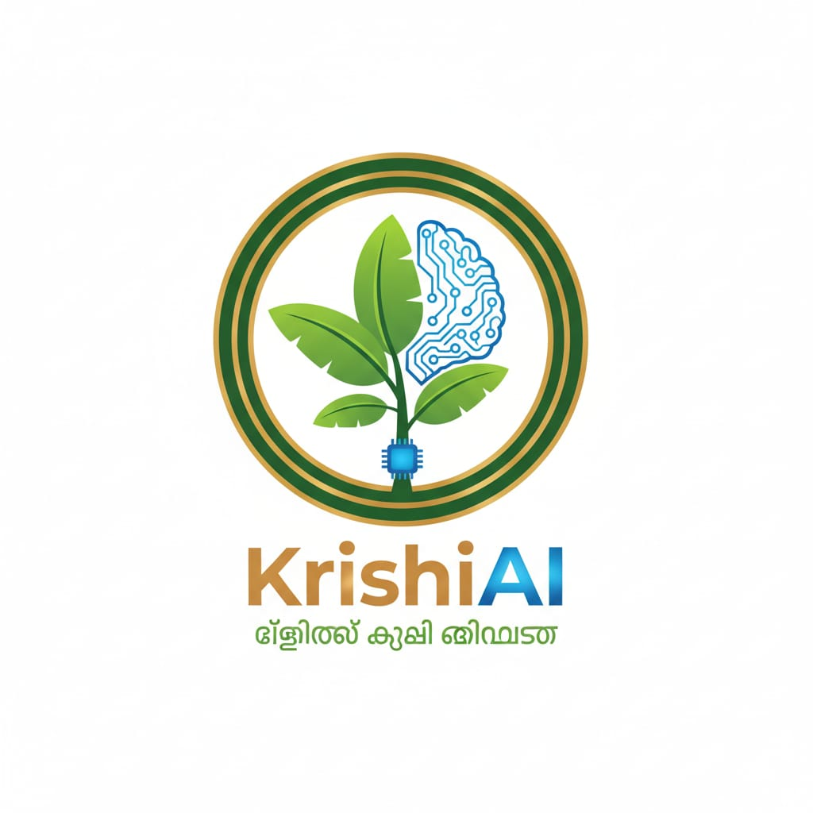
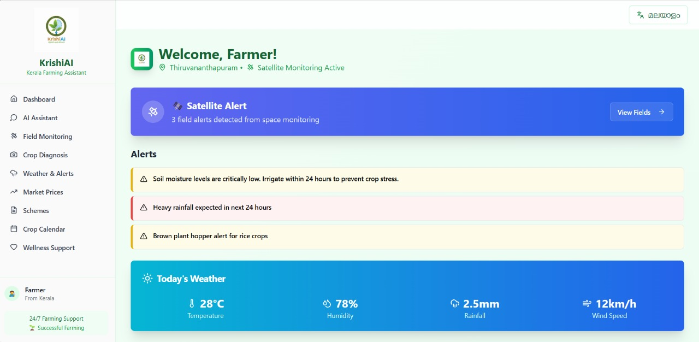
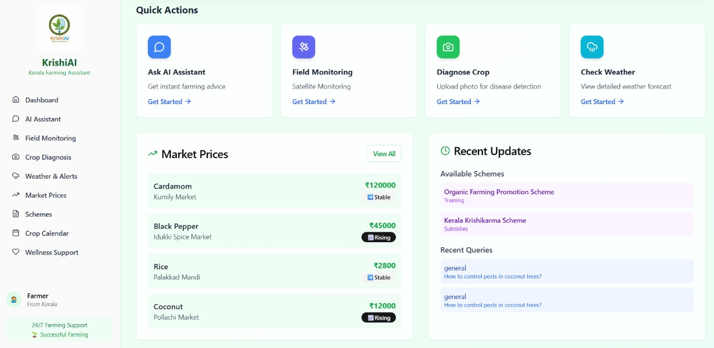
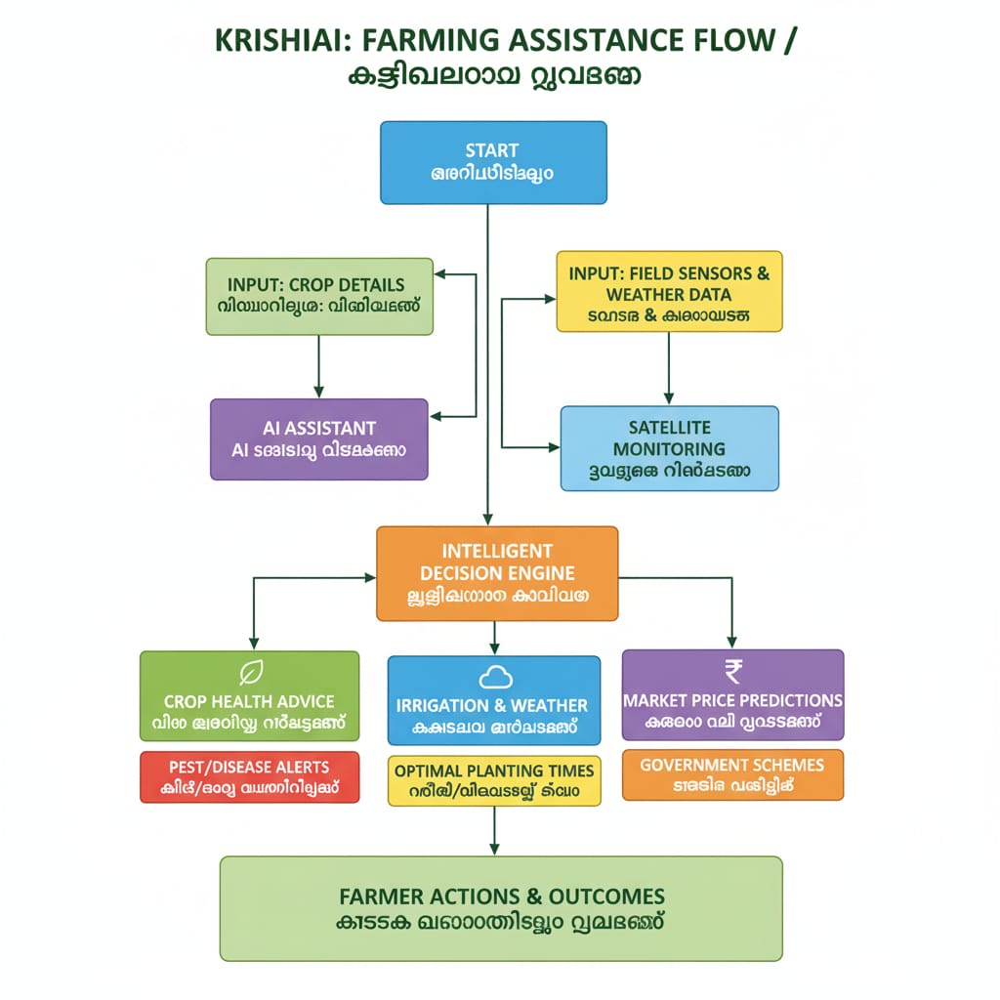

  

<h1 align="center">🌾 KRISHI AI – Kerala Farming Assistant</h1>

  A smart agriculture assistant for Kerala farmers, delivering AI-driven insights, real-time data, and government scheme access.
   
  <em>Developed for the Smart India Hackathon (SIH) Grand Finale 2025.</em>

---

## 🚀 Problem & Solution

*The Problem:* Kerala’s 7.5 million farming households, who contribute nearly 10% to the state's GSDP, face significant challenges. Fragmented landholdings (avg. 0.18 ha) and annual crop losses of 15–25% due to preventable pests and climate events limit their income and potential. Crucially, there is no single, farmer-friendly platform that unifies critical information on weather, market prices, and government schemes.

*Our Mission:* To empower every farmer with timely, data-driven, and localized intelligence that improves yield, boosts income, and promotes sustainable agricultural practices.

*The Solution:* KrishiAI is a bilingual (English/Malayalam), mobile-first AI assistant that provides a unified dashboard for all farming needs. It delivers personalized, actionable insights by integrating various APIs and AI models, all presented in a simple, accessible interface.

---

## ⚡ Core Features

| Feature | Description |
|---|---|
| 🌾 *Crop Advisor* | Suggests optimal crops based on soil type, location, and season. |
| 🐛 *Pest Detector* | Uses image recognition to diagnose crop diseases from an uploaded photo. |
| ☁ *Weather Alerts* | Provides real-time weather data and AI-driven warnings (e.g., "Irrigate tomorrow"). |
| 💰 *Market Prices* | Displays live mandi rates from local markets to help farmers get the best price. |
| 📜 *Scheme Finder* | Checks farmer eligibility for government schemes and provides application guidance. |
| 🧘 *Wellness Support* | Includes farmer wellness check-ins and mental health support resources. |

---

## 🖼 Application User Interface

The UI is designed for clarity and ease of use, with full support for both English and Malayalam.

| Main Dashboard (Alerts & Weather) | Quick Actions & Market Prices |
| :---: | :---: |
|  |  |

---

## 🧠 Technical Approach & Architecture

### Technology Stack
- *Frontend:* React + Tailwind CSS (mobile-first, responsive, bilingual UI).
- *Backend / AI:* ChatGPT + Gemini hybrid AI engine for contextual query processing.
- *Key APIs:*
    - Google (Vision, Weather, Maps)
    - Government & Local (AgriMarket, IMD, Kathir Portal)
    - Scientific (ISRO/NASA Sentinel for NDVI analysis)
- *Database:* Manages farmer profiles, crop data, and market prices to deliver personalized insights.

### System Architecture Flowchart
This flowchart illustrates the core data flow of KrishiAI, from multiple data sources to the actionable advice delivered to the farmer.

---

## 📊 Feasibility

- *Technical:* Built on proven, scalable frameworks (React, APIs, AI).
- *Operational:* Kerala's high literacy (96.2%) and internet penetration (75%) ensure a ready user base.
- *Economic:* Low development cost using open APIs. Strong potential for funding via CSR and the Kerala Startup Mission.

---

## ⚠ Challenges & Mitigation

| Challenge | Impact | Mitigation |
|---|---|---|
| Connectivity gaps in hills | Missed alerts | Offline caching + "Krishi Mitra" field agent support. |
| Inconsistent govt datasets | Wrong info | Data cleaning algorithms + fallback APIs. |
| Farmer trust in AI | Adoption barrier | Knowledge base grounded in trusted sources (e.g., KAU) + local pilot programs. |
| Language/tech barrier | Low adoption | Fully localized Malayalam UI, voice input, and simple navigation. |

---

## 🌱 Impact & Benefits

- *For Farmers:* Anticipated 5–10% increase in price realization, 15–25% reduction in crop losses, and optimized input costs.
- *For Kerala:* Strengthened agricultural GSDP, a boost for the spice export market, and valuable data for state-level policymaking.

---

## 🔮 Future Scope

- *Offline Mode:* Full functionality for remote and low-connectivity areas.
- *Hardware Integration:* Connect with IoT sensors and drones for precision farming.
- *Community Forum:* A platform for farmers to connect and share knowledge.
- *Pan-India Expansion:* Adapt the platform with regional crop calendars and schemes for other states.

---

## 👥 Team KRISHI AI

| Name | Role |
|---|---|
| Om Shinde | Lead Developer |
| Aditya Shinde | Assistant Developer & API/AI Integrator |
| Tejas Veer | Research & Analysis (Farmer & Field Insights) |
| Sagardeep Barman | Research & Analysis (Farmer & Field Insights) |
| Amulya Pitta | Presentation & Documentation |
| Sanskruti Sangle | Presentation & Documentation |

---

## 🔗 Live App & Demo

- *Live App:* [https://krishi-ai-cd0bf75a.base44.App](https://krishi-ai-cd0bf75a.base44.App)
- *Demo Video:* [https://youtu.be/UehSdh3kKb4?si=U1MWWRhzwISETHfO](https://youtu.be/UehSdh3kKb4?si=U1MWWRhzwISETHfO)

---

## 📚 Learnings

- Successfully built a functional application using AI-powered, no-code/low-code development tools.
- Mastered the integration of diverse, real-world APIs to create a cohesive user experience.
- Gained deep insights into farmer-centric design through extensive research and user feedback.

---

## 📬 Contact

For queries or collaboration: 
**krishiaisih@gmail.com**
**omshi280507@gmail.com**
                              
---

## ⭐ Support

If you found this project useful, give it a ⭐ on GitHub!
